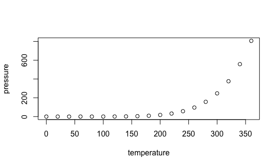

p8105_hw3_mc5698
================
2024-10-09

    ## ── Attaching core tidyverse packages ──────────────────────── tidyverse 2.0.0 ──
    ## ✔ dplyr     1.1.4     ✔ readr     2.1.5
    ## ✔ forcats   1.0.0     ✔ stringr   1.5.1
    ## ✔ ggplot2   3.5.1     ✔ tibble    3.2.1
    ## ✔ lubridate 1.9.3     ✔ tidyr     1.3.1
    ## ✔ purrr     1.0.2     
    ## ── Conflicts ────────────────────────────────────────── tidyverse_conflicts() ──
    ## ✖ dplyr::filter() masks stats::filter()
    ## ✖ dplyr::lag()    masks stats::lag()
    ## ℹ Use the conflicted package (<http://conflicted.r-lib.org/>) to force all conflicts to become errors

\#Problem 1

``` r
#Access to the dataset
library(p8105.datasets)
data("ny_noaa")
```

``` r
#clean the dataset
data_ny = ny_noaa %>%
  janitor::clean_names() |>
  drop_na(tmin,tmax,date)|>
  mutate(
    year = year(date),
    month = month(date, label = TRUE),
    day = day(date),
    tmax = as.numeric(tmax) / 10,   
    tmin = as.numeric(tmin) / 10,
    prcp = prcp / 10,               
    snow = as.numeric(snow)        
  ) 
```

``` r
snowfall= data_ny %>%
  filter(!is.na(snow)) %>%
  count(snow)%>%
  arrange(desc(n))
```

For snowball,the most commonly observed values is 0, which means that
most days are not snowy.

\#Problem 2

## R Markdown

This is an R Markdown document. Markdown is a simple formatting syntax
for authoring HTML, PDF, and MS Word documents. For more details on
using R Markdown see <http://rmarkdown.rstudio.com>.

When you click the **Knit** button a document will be generated that
includes both content as well as the output of any embedded R code
chunks within the document. You can embed an R code chunk like this:


