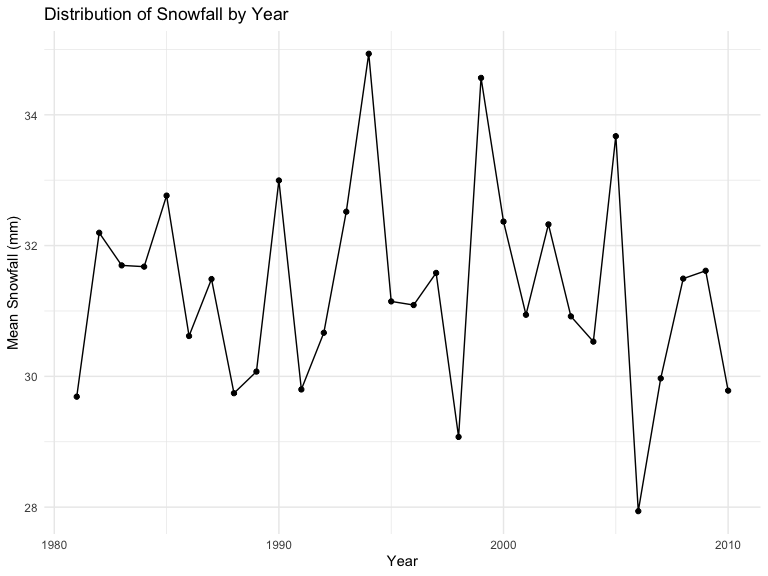

p8105_hw3_mc5698
================
2024-10-09

    ## ── Attaching core tidyverse packages ──────────────────────── tidyverse 2.0.0 ──
    ## ✔ dplyr     1.1.4     ✔ readr     2.1.5
    ## ✔ forcats   1.0.0     ✔ stringr   1.5.1
    ## ✔ ggplot2   3.5.1     ✔ tibble    3.2.1
    ## ✔ lubridate 1.9.3     ✔ tidyr     1.3.1
    ## ✔ purrr     1.0.2     
    ## ── Conflicts ────────────────────────────────────────── tidyverse_conflicts() ──
    ## ✖ dplyr::filter() masks stats::filter()
    ## ✖ dplyr::lag()    masks stats::lag()
    ## ℹ Use the conflicted package (<http://conflicted.r-lib.org/>) to force all conflicts to become errors

\#Problem 1

``` r
#Access to the dataset
library(p8105.datasets)
data("ny_noaa")
```

``` r
#clean the dataset
data_ny = ny_noaa %>%
  janitor::clean_names() |>
  drop_na(tmin,tmax,date)|>
  mutate(
    year = year(date),
    month = month(date, label = TRUE),
    day = day(date),
    tmax = as.numeric(tmax) / 10,   
    tmin = as.numeric(tmin) / 10,
    prcp = prcp / 10,               
    snow = as.numeric(snow)        
  ) 
```

``` r
snowfall= data_ny %>%
  filter(!is.na(snow)) %>%
  count(snow)%>%
  arrange(desc(n))
```

For snowball,the most commonly observed values is 0, which means that
most days are not snowy.

``` r
#Calculate the average max temperature in January and in July in each station across years
max_jan<- data_ny %>%
  filter(month == "Jan") %>%
  group_by(year) %>%
  summarize(jan_mean_tmax = mean(tmax), .groups = 'drop')

max_jul<- data_ny %>%
  filter(month == "Jul") %>%
  group_by(year) %>%
  summarize(jul_mean_tmax = mean(tmax), .groups = 'drop')

combined_tmax = left_join(max_jan, max_jul, by ="year" ) %>%
  pivot_longer(
    cols = c(jan_mean_tmax, jul_mean_tmax),  
    names_to = "month",                     
    values_to = "mean_tmax"                  
  ) %>%
  mutate(
    month = recode(month,                
                   jan_mean_tmax = "Jan",
                   jul_mean_tmax = "Jul")
  )
```

``` r
#Make a two-panel plot showing the average max temperature in January and in July 
ggplot(data = combined_tmax, aes(x = year, y = mean_tmax, color = month)) +
  geom_line(alpha = 0.5) +
  facet_wrap(~ month, ncol = 1) +
  labs(
    title = "Average Maximum Temperature in January and July",
    x = "Year",
    y = "Average Maximum Temperature (C)"
  ) +
  theme(legend.position = "bottom")
```


``` r
#Make a two-panel plot 
ggplot(data_ny, aes(x = tmin, y = tmax)) +
  geom_hex() +
  labs(
    title = "Plot of tmax vs tmin",
    x = "Minimum Temperature (C)",
    y = "Maximum Temperature (C)"
  ) +
  theme_minimal() 
```



``` r
#Make a plot showing the distribution of snowfall values
snowfall_data <- data_ny %>%
  filter(snow > 0 & snow < 100) %>%
  group_by(year) %>%
  summarize(mean_snowfall = mean(snow, na.rm = TRUE), .groups = 'drop')

ggplot(snowfall_data, aes(x = year, y = mean_snowfall)) +
  geom_point() + geom_line() +
  labs(
    title = "Distribution of Snowfall by Year",
    x = "Year",
    y = "Mean Snowfall (mm)"
  ) +
  theme_minimal()
```


\#Problem 2

``` r
#Read and clean the datasets
demographics =
  read.csv("/Users/nicolechen/Downloads/p8105_hw3_mc5698/data/nhanes_covar.csv") %>%
  janitor::clean_names() %>%
  rename("seqn" = "x") %>%
  filter("age" >= 21) %>%
  drop_na()

accelerometer =
  read.csv("/Users/nicolechen/Downloads/p8105_hw3_mc5698/data/nhanes_accel.csv") %>%
  janitor::clean_names()
```

``` r
#Convert 'seqn' to character 
accelerometer <- accelerometer %>%
  mutate(seqn = as.character(seqn))

#Merge two datasets
merged_data =left_join(demographics, accelerometer, by = "seqn")
```

## R Markdown

This is an R Markdown document. Markdown is a simple formatting syntax
for authoring HTML, PDF, and MS Word documents. For more details on
using R Markdown see <http://rmarkdown.rstudio.com>.

When you click the **Knit** button a document will be generated that
includes both content as well as the output of any embedded R code
chunks within the document. You can embed an R code chunk like this:


